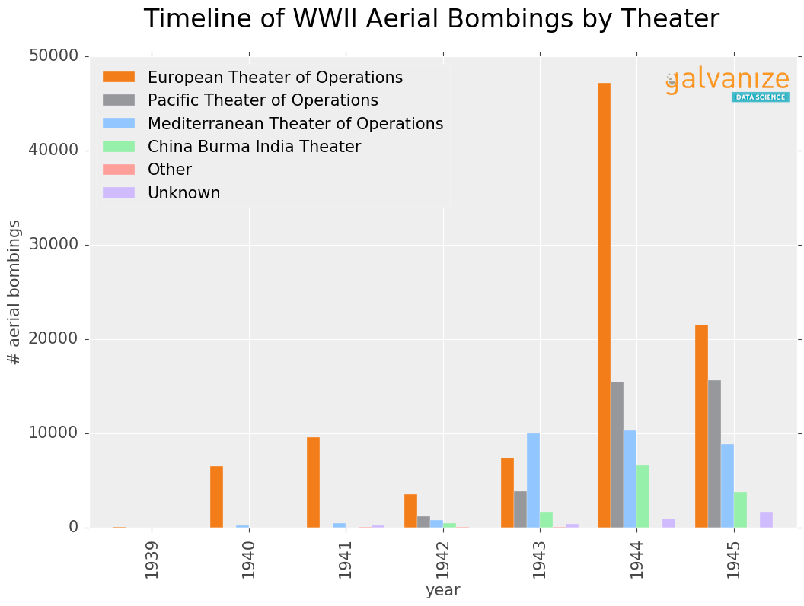

# Galvanize Themed Matplotlib Figures!

Here's a sample:



# How to use this theme

Run the following commands in your shell:
```bash
> wget https://raw.githubusercontent.com/acu192/analysis-thor/master/galvanize_theme_resources/galvanize.mplstyle
> mkdir -p ~/.matplotlib/stylelib/
> cp galvanize.mplstyle ~/.matplotlib/stylelib/
```

In your python script, run the following code to use the theme:

```python
import matplotlib
import matplotlib.pyplot as plt
%matplotlib inline

if 'galvanize' in plt.style.available:
    plt.style.use('galvanize')
else:
    print 'Forgoing the galvanize matplotlib style...'
```

**At this point, your plots should have a nice Galvanize theme to them.**

# How to watermark you plots with the Galvanize Data Science logo (optional)

Run the following shell commands (within your project directory):
```bash
> wget https://github.com/acu192/analysis-thor/raw/master/galvanize_theme_resources/ATX%20Galvanize%20Data%20Science%20(small).png
> mkdir galvanize_theme_resources
> mv "ATX Galvanize Data Science (small).png" galvanize_theme_resources
> wget https://github.com/acu192/analysis-thor/raw/master/helper.py
```

In your python script, use the following code:
```python
from helper import watermark_fig

...

fig = ...
watermark_fig(fig, X_POS, Y_POS)
```

# Debugging Stuff

If you need to debug stuff, here's some things which help:
```python
with plt.style.context(('galvanize')):  # <-- you can do that to temporarily use a style
    # plotting code
    pass

plt.style.reload_library()         # <-- reloads all the themes from disk

print matplotlib.get_configdir()   # <-- prints the folder where the themes are stored
```

